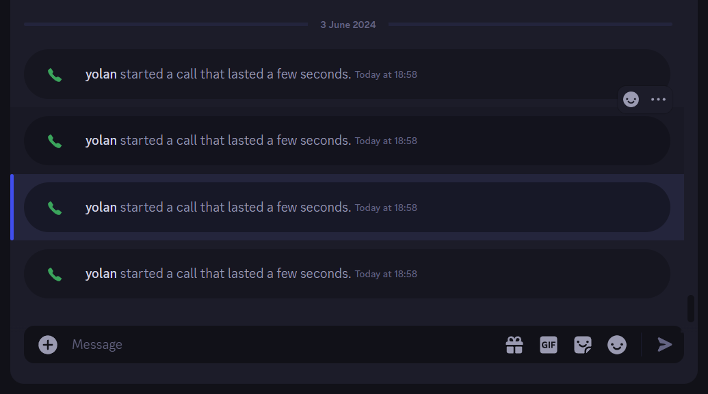

# midnight-blurple

a darkened discord theme with rounded corners and using blurple as accent color.

forked from the [midnight-discord](https://github.com/refact0r/midnight-discord) theme because I wanted to add my own fixes and UI magic

 *Zoom level at 125%*

## nice things

| feature | preview |
|:-|:-|
| `animated context menu` a quick animation so that it looks cool and also to not get in the way |  *Zoom level at 125%, colors are fudged because of the gif format* |
| `elevated system messages` to differentiate them from the other messages |  *Zoom level at 125%* |

## vencord plugins added support

| feature | preview |
|:-|:-|
| `PinDMs` if you select this default color for a category, it will instead use the theme's headings color so it looks more consistent |  |

# install

> [!IMPORTANT]
> make sure to enable dark mode in discord settings for the theme to apply properly! (if you want light mode customize the theme color variables)

#### betterdiscord (or client with local theme folder)

1. download [`midnight-blurple.theme.css`](https://yolanare.github.io/midnight-discord-blurple/midnight-blurple.theme.css) from this repo
2. put the file into your theme folder. (there should be a button to open the theme folder in theme settings)

#### install through link

add `https://yolanare.github.io/midnight-discord-blurple/midnight.css` to your theme import links

## credits

forked from <https://github.com/refact0r/midnight-discord>, fantastic work !
